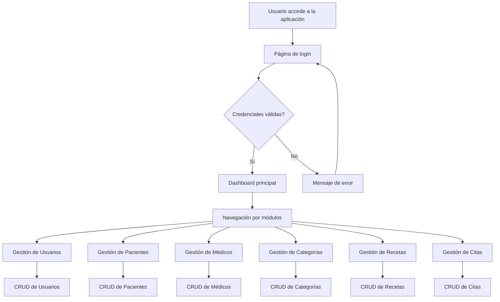

# AS231S3_T12-be


## 🏥 Descripción del Proyecto

Sistema web para la gestión de citas médicas en una clínica u hospital. El sistema permite administrar pacientes, médicos, usuarios, categorías y citas médicas, con funcionalidades CRUD completas y autenticación de usuarios.

## 🛠️ Tecnologías Utilizadas

### Backend
- **Lenguaje**: Java 11
- **Framework**: Jakarta EE 9.1 (MVC)
- **Gestión de Dependencias**: Maven
- **Base de Datos**: Microsoft SQL Server
- **Controlador JDBC**: mssql-jdbc 9.2.1.jre11

### Frontend
- **Vistas**: JSP (JavaServer Pages)
- **Plantillas**: JSTL (JavaServer Pages Standard Tag Library)
- **Estilos**: CSS, Bootstrap
- **Interactividad**: JavaScript, jQuery

### Herramientas Adicionales
- **Lombok**: Reducción de código boilerplate
- **JBCrypt**: Hashing de contraseñas
- **SweetAlert**: Alertas y notificaciones

## 📁 Estructura del Proyecto

```
src/
├── main/
│   ├── java/pe/edu/vallegrande/projectsoftware/
│   │   ├── controller/        # Controladores MVC
│   │   ├── service/           # Lógica de negocio
│   │   ├── dto/               # Objetos de transferencia de datos
│   │   ├── db/                # Conexión a base de datos
│   │   └── test/              # Pruebas
│   ├── resources/
│   │   └── META-INF/
│   │       ├── beans.xml      # Configuración CDI
│   │       └── persistence.xml # Configuración JPA
│   └── webapp/
│       ├── WEB-INF/
│       │   └── web.xml        # Configuración web
│       ├── admin/             # Vistas de administración
│       ├── assets/            # Recursos estáticos (CSS, JS, imágenes)
│       └── index.jsp          # Página de inicio/login
├── README.md
├── pom.xml                   # Configuración Maven
└── mvnw.cmd                 # Script Maven
```

## 🔄 Arquitectura MVC

### Modelo (Model)
- **DTOs**: Objetos de transferencia de datos (UserDto, PacientDto, MedicDto, etc.)
- **Servicios**: Lógica de negocio (UserService, PacientService, MedicService, etc.)
- **Acceso a Datos**: Conexión directa a base de datos mediante SqlConnection

### Vista (View)
- **JSP**: Páginas web dinámicas
- **JSTL**: Etiquetas personalizadas para lógica en vistas
- **CSS/JS**: Estilos y comportamiento frontend

### Controlador (Controller)
- **Controladores**: Manejo de solicitudes HTTP (UserController, PacientController, etc.)
- **Enrutamiento**: Mapeo de URLs a métodos específicos

## 🔧 Componentes Principales

### Controladores
- [UserController.java](src/main/java/pe/edu/vallegrande/projectsoftware/controller/UserController.java) - Gestión de usuarios administrativos
- [PacientController.java](src/main/java/pe/edu/vallegrande/projectsoftware/controller/PacientController.java) - Gestión de pacientes
- [MedicController.java](src/main/java/pe/edu/vallegrande/projectsoftware/controller/MedicController.java) - Gestión de médicos
- [CategoryController.java](src/main/java/pe/edu/vallegrande/projectsoftware/controller/CategoryController.java) - Gestión de categorías
- [PrescriptionController.java](src/main/java/pe/edu/vallegrande/projectsoftware/controller/PrescriptionController.java) - Gestión de recetas médicas
- [LoginController.java](src/main/java/pe/edu/vallegrande/projectsoftware/controller/LoginController.java) - Autenticación de usuarios
- [LogoutController.java](src/main/java/pe/edu/vallegrande/projectsoftware/controller/LogoutController.java) - Cierre de sesión
- [homeController.java](src/main/java/pe/edu/vallegrande/projectsoftware/controller/homeController.java) - Panel principal/dashboard

### Servicios
- [UserService.java](src/main/java/pe/edu/vallegrande/projectsoftware/service/UserService.java) - Lógica de negocio para usuarios
- [PacientService.java](src/main/java/pe/edu/vallegrande/projectsoftware/service/PacientService.java) - Lógica de negocio para pacientes
- [MedicService.java](src/main/java/pe/edu/vallegrande/projectsoftware/service/MedicService.java) - Lógica de negocio para médicos
- [CategoryService.java](src/main/java/pe/edu/vallegrande/projectsoftware/service/CategoryService.java) - Lógica de negocio para categorías
- [PrescriptionService.java](src/main/java/pe/edu/vallegrande/projectsoftware/service/PrescriptionService.java) - Lógica de negocio para recetas
- [LoginService.java](src/main/java/pe/edu/vallegrande/projectsoftware/service/LoginService.java) - Lógica de autenticación
- [homeService.java](src/main/java/pe/edu/vallegrande/projectsoftware/service/homeService.java) - Lógica del dashboard

### DTOs (Data Transfer Objects)
- [UserDto.java](src/main/java/pe/edu/vallegrande/projectsoftware/dto/UserDto.java) - Representación de usuarios
- [PacientDto.java](src/main/java/pe/edu/vallegrande/projectsoftware/dto/PacientDto.java) - Representación de pacientes
- [MedicDto.java](src/main/java/pe/edu/vallegrande/projectsoftware/dto/MedicDto.java) - Representación de médicos
- [CategoryDto.java](src/main/java/pe/edu/vallegrande/projectsoftware/dto/CategoryDto.java) - Representación de categorías
- [PrescriptionDto.java](src/main/java/pe/edu/vallegrande/projectsoftware/dto/PrescriptionDto.java) - Representación de recetas

### Vistas Principales
- [index.jsp](src/main/webapp/index.jsp) - Página de inicio/login
- [admin/layout.jsp](src/main/webapp/admin/layout.jsp) - Panel principal/dashboard
- [admin/Users/user.jsp](src/main/webapp/admin/Users/user.jsp) - Gestión de usuarios
- [admin/Pacient/pacient.jsp](src/main/webapp/admin/Pacient/pacient.jsp) - Gestión de pacientes
- [admin/Medic/medic.jsp](src/main/webapp/admin/Medic/medic.jsp) - Gestión de médicos
- [admin/Category/newcategory.jsp](src/main/webapp/admin/Category/newcategory.jsp) - Gestión de categorías
- [admin/Prescription/prescription.jsp](src/main/webapp/admin/Prescription/prescription.jsp) - Gestión de recetas

## 🌐 Diagrama de Flujo de la Aplicación



## ⚙️ Configuración del Proyecto

### Requisitos Previos
- Java JDK 11
- Apache Maven 3.6+
- Microsoft SQL Server
- IDE compatible con Java (IntelliJ IDEA, Eclipse, VSCode, etc.)

### Dependencias Principales
```xml
<dependencies>
    <dependency>
        <groupId>org.projectlombok</groupId>
        <artifactId>lombok</artifactId>
        <version>1.18.32</version>
        <scope>provided</scope>
    </dependency>
    <dependency>
        <groupId>jakarta.platform</groupId>
        <artifactId>jakarta.jakartaee-api</artifactId>
        <version>9.1.0</version>
        <scope>provided</scope>
    </dependency>
    <dependency>
        <groupId>jakarta.mvc</groupId>
        <artifactId>jakarta.mvc-api</artifactId>
        <version>2.0.0</version>
    </dependency>
    <dependency>
        <groupId>com.microsoft.sqlserver</groupId>
        <artifactId>mssql-jdbc</artifactId>
        <version>9.2.1.jre11</version>
    </dependency>
    <dependency>
        <groupId>org.mindrot</groupId>
        <artifactId>jbcrypt</artifactId>
        <version>0.4</version>
    </dependency>
</dependencies>
```

## 🗄️ Configuración de Base de Datos

La conexión a la base de datos se configura en [SqlConnection.java](src/main/java/pe/edu/vallegrande/projectsoftware/db/SqlConnection.java):

```java
String bd = "jdbc:sqlserver://localhost:14033;databaseName=sbs_cy;encrypt=true;trustServerCertificate=True;";
String user = "SA";
String pass = "HENRY_10";
```

## ▶️ Ejecución del Proyecto

### Compilación y Ejecución
```bash
# Compilar el proyecto
mvn compile

# Empaquetar la aplicación
mvn package

# Ejecutar la aplicación (requiere servidor compatible)
# Por ejemplo, usando Tomcat:
mvn tomcat7:run
```

## 👥 Roles de Usuario

- **Administrador**: Acceso completo a todas las funcionalidades
- **Usuario Regular**: Acceso limitado según configuración

## 📱 Funcionalidades Principales

1. **Autenticación de Usuarios**
   - Login seguro con verificación de credenciales
   - Protección de rutas no autorizadas

2. **Gestión de Usuarios**
   - Crear, leer, actualizar y eliminar usuarios
   - Asignación de roles (administrador/usuario)

3. **Gestión de Pacientes**
   - Registro completo de datos personales
   - Historial médico y alergias

4. **Gestión de Médicos**
   - Información profesional y especialidades
   - Disponibilidad y horarios

5. **Gestión de Categorías**
   - Clasificación de servicios médicos
   - Especialidades médicas

6. **Gestión de Recetas**
   - Generación de recetas electrónicas
   - Seguimiento de tratamientos

7. **Panel de Control**
   - Métricas y estadísticas del sistema
   - Calendario de citas
   - Resúmenes de información clave

## 🔒 Seguridad

- Contraseñas almacenadas con hash (JBCrypt)
- Sesiones de usuario gestionadas por el servidor
- Validación de entrada en formularios
- Protección contra acceso no autorizado

## 🧪 Pruebas

Las pruebas se encuentran en el paquete [test](src/main/java/pe/edu/vallegrande/projectsoftware/test/):

- [PruebaConexion.java](src/main/java/pe/edu/vallegrande/projectsoftware/test/PruebaConexion.java) - Verificación de conexión a base de datos

## 📦 Empaquetado

El proyecto se empaqueta como un archivo WAR (Web Application Archive) listo para ser desplegado en servidores compatibles con Servlets como Tomcat, Jetty, etc.

## 🤝 Contribuidores

### Equipo de desarrollo Valle Grande

- Johan Malasquez
- Henry Lunazco

## 📄 Licencia

Este proyecto es parte de las actividades académicas del curso de Desarrollo de Software en el Instituto Valle Grande.